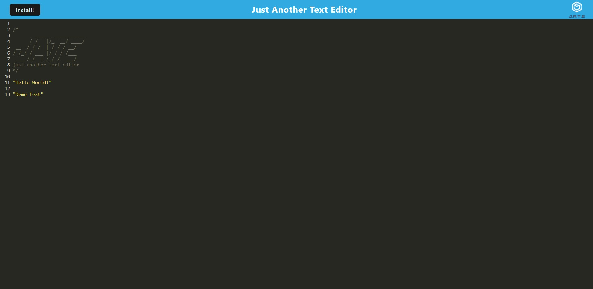

# Text_Editor

## Description

The goal of this project was to modify a given codebase to create a functioning text editor using React. The created site acts as a text editor that may be either opened in browser or in its own separate window. During this project I learned how to use React when creating webpages.

## Installation

The runtime Node.js must be installed, after which all necessary packages can be installed by typing "npm i" into the terminal while in the main, client, and server directories. The site may be run from a computer by typing "npm run start" into the terminal while in the main directory.

## Usage

The created site acts as a text editor which may be either open in a web browser or may be installed on the desktop. The site may be used while offline and stores entered text when closing a seesion.

## Credits

N/A

## License

Please refer to the license in the repo

## Links and Images
Github Repo URL: https://github.com/fortu038/Text_Editor

Active Site URL: 

